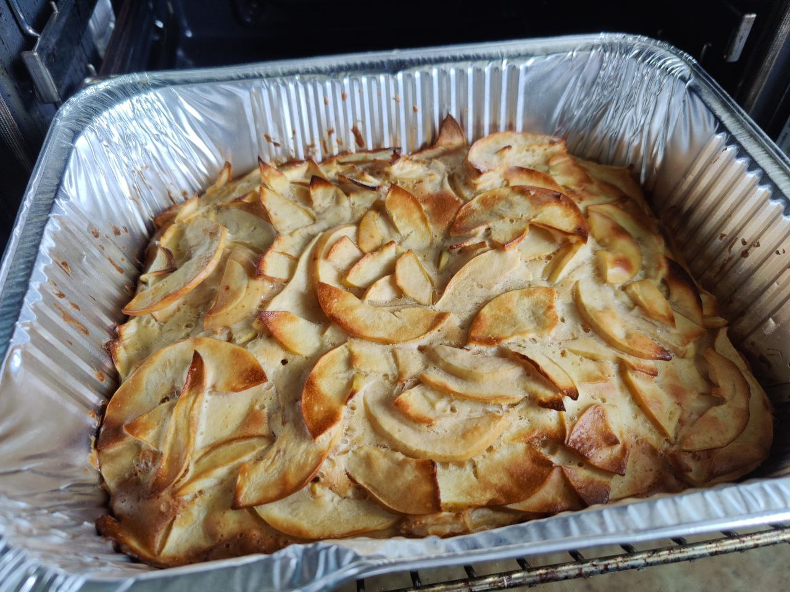

# Apple Pie

* 1kg of Granny Smith apples
* sweetener 50g
* erythritol 50g
* salt 0.5g
* baking powder 5g
* vanilla extract 5g
* flour 200g
* 6 eggs

# Stage 1

* blend egg whites with erythritol
* blend yolks with sweetener and vanilla extract
* mix together and add flour, salt, baking powder

# Stage 2

* cut apples to 3mm slices and put to a baking form
* add dough and mix everything with a spoon
* bake in a 180C oven for 35 minutes
