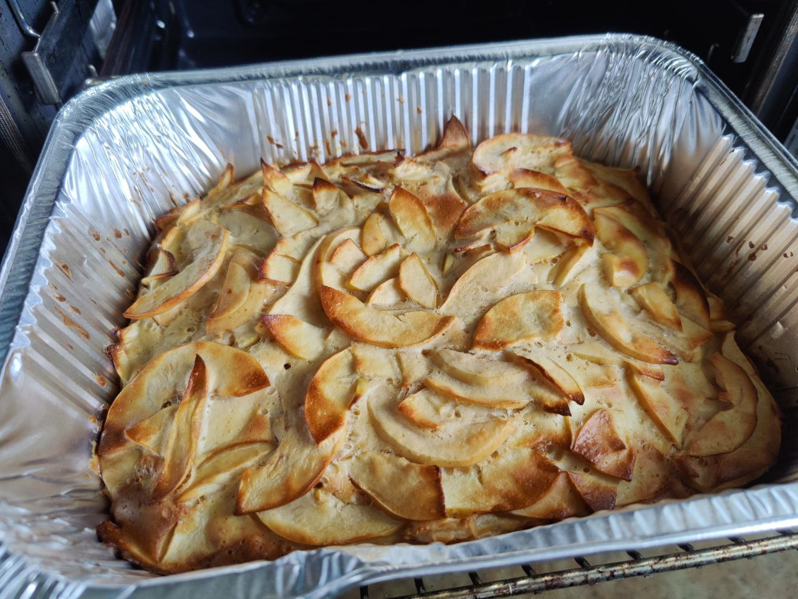

# Apple Pie

* apples 300g

* 4 eggs
* vanilla extract 5g
* sweetener 10g
* 1/2 lemon

* cinnamon 1g
* salt 1g
* baking powder 5g
* baking soda 0.1g
* flour 140g

# Stage 1
* bake in a 170C oven for 30 minutes
