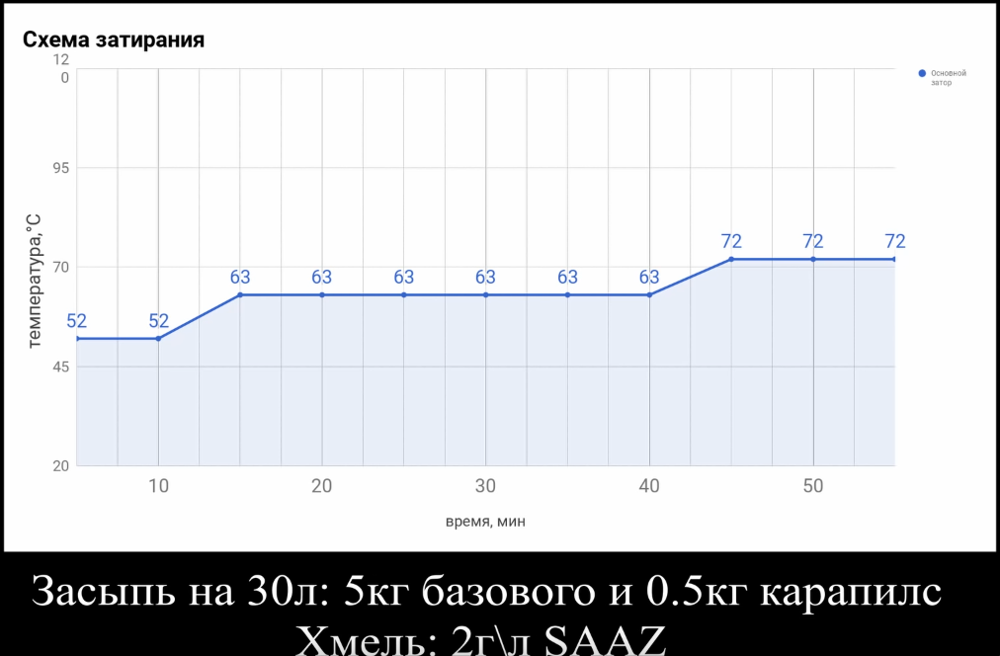

# [First beer](https://youtu.be/Z5Ri_Oe3YmA)

## Схема

* 10л воды, 1.6кг базового, 170г карапилс, 20г хмеля
* 52, 10 минут
* нагрев до 62-65, 30 минут
* 72, 15 минут

## Дезинфекция

* прокипятить 10 минут мешок для затирания
* помыть кастрюлю с fairy
* помыть бродилку с перекисью

## Затирка

* нагреть воду в кастрюле 5л до 55
* закрепить мешок на кастрюле
* засыпаем базовый солод и перемешиваем (далее перемешиваем каждые 5-7 минут), выключаем нагрев
* закрываем крышку, ждем 5-7 минут
* нагреваем до 63-65, засыпаем кармельный солод, ждем 25 минут, проверяем чтобы температура не упала ниже 62
* нагреваем до 72
* промываем бродилку 4-5 раз горячей водой от перекиси
* включаем нагрев на максимум
* переносим мешок в бродилку, промываем 3л воды, выливаем из бродилки обратно в кастрюлю, ждем закипания

## Варка сусла

* после кипения ждем 10-15 минут, засыпаем первую порцию хмеля, размешиваем
* засыпать еще порцию хмеля через 30 минут
* засыпать еще порцию хмеля через 15 минут
* подготавливаем шланг
* засыпать еще порцию хмеля через 15 минут, выключаем температуру
* сливаем сусло в бродилку
* максимально быстро охладить сусло в ванной до 60-70 градусов
* охладить до 24 градусов и засеять 1/2 пакетика с дрожжами
